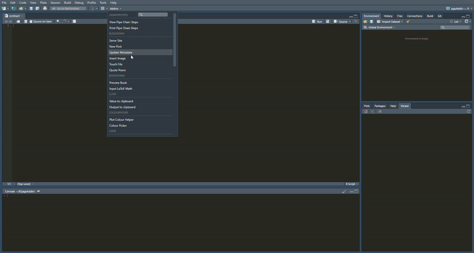

# jagsAddIn
## RStudio addin for creating jags in R template code

---

Feel free to install it from my GitHub via  
`devtools::install_github('n8thangreen/jagsAddIn')`.

If you encounter any bugs, please report them as an 
[issue](https://github.com/n8thangreen/jagsAddIn/issues).

---

## Example

